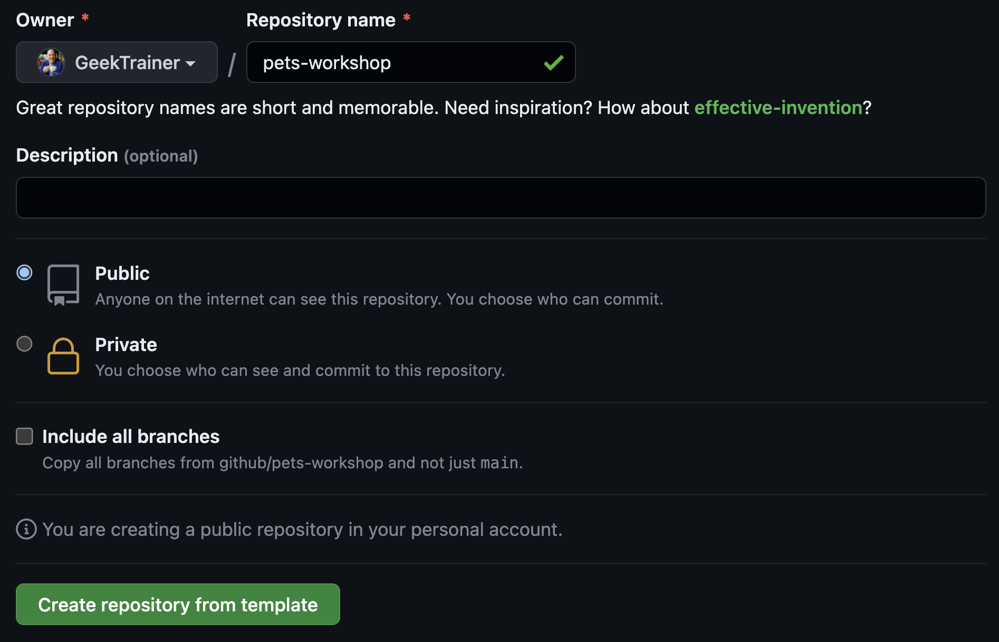

原文: https://github.com/github-samples/pets-workshop/blob/6eaf29e155d12b62700aa06a97b803ac1aa1130a/content/1-hour/0-setup.md

# ワークショップのセットアップ

| [← GitHub Copilotの開始][walkthrough-previous] | [次へ: GitHub Copilotでコーディング →][walkthrough-next] |
|:-----------------------------------|------------------------------------------:|

このワークショップを完了するには、このリポジトリの内容をコピーしたリポジトリを作成する必要があります。これは[リポジトリのフォーク][fork-repo]で行うことができますが、フォークの目的は最終的にコードを元の（またはアップストリーム）ソースにマージすることです。私たちの場合、変更をマージする意図がないため、別のコピーが必要です。これは[テンプレートリポジトリ][template-repo]の使用によって実現されます。テンプレートリポジトリは、組織にスターターを提供し、プロジェクト間での一貫性を確保する優れた方法です。

このワークショップのリポジトリはテンプレートとして設定されているため、これを使用してあなたのリポジトリを作成できます。

> [!IMPORTANT]
> [必要なソフトウェア][required-software]と[必要なリソース][required-resources]のセットアップが完了していることを確認してください。

## リポジトリの作成

ワークショップで使用するリポジトリを作成しましょう。

1. [翻訳前のワークショップリポジトリ https://github.com/github-samples/pets-workshop/](https://github.com/github-samples/pets-workshop/) に移動します
2. **Use this template** > **Create a new repository**を選択します

    

3. **Owner**の下で、あなたのGitHubハンドルの名前、またはワークショップリーダーが指定した所有者を選択します。
4. **Repository**の下で、名前を**pets-workshop**に設定するか、ワークショップリーダーが指定した名前にします。
5. 可視性に**Public**が選択されていることを確認するか、ワークショップリーダーが指示した値にします。
6. **Create repository from template**を選択します。

    

しばらくすると、このワークショップのテンプレートから新しいリポジトリが作成されます！

## リポジトリのクローンとアプリの開始

リポジトリが作成されたので、今度はリポジトリをローカルにクローンします。BASHコマンドを実行できるシェルから行います。

1. 前のセットで作成したリポジトリのURLをコピーします。
2. ターミナルまたはコマンドシェルを開きます。
3. 次のコマンドを実行してリポジトリをローカルにクローンします（適切に親ディレクトリにディレクトリを変更してください）：

    ```sh
    git clone <INSERT_REPO_URL_HERE>
    ```

4. 次のコマンドを実行してクローンしたリポジトリにディレクトリを変更します：

    ```sh
    cd <REPO_NAME_HERE>
    ```

5. 次のコマンドを実行してアプリケーションを開始します：

    ```sh
    ./scripts/start-app.sh
    ```

スタートアップスクリプトは2つのアプリケーションを開始します：

- [localhost:5100][flask-url]のバックエンドFlaskアプリ。[dogs API][dogs-api]を開くことで犬のリストを見ることができます。
- [localhost:4321][astro-url]のフロントエンドAstro/Svelteアプリ。そのURLを開くことで[ウェブサイト][website-url]を見ることができます。

### 日本コミュニティの補足

#### Windowsでの実行

Windowsを使用している場合、PowerShellにて`./scripts/start-app.ps1`が使用できます。

#### nodejs、pythonを環境管理ツールで実行している方

環境を立ち上げるコマンド[./scripts/start-app.sh](https://github.com/github-samples/pets-workshop/blob/main/scripts/start-app.sh)は、Python、Node.jsのパッケージをインストールし、さらに開発サーバを立ち上げるスクリプトです。

macOS/linuxでは`python3`、`pip`、`npm`、Windowsでは`py`、`pip`、`npm`のコマンドが実行できることを前提とされています。

このコマンドは、パッケージのインストール段階として以下のことを行っています。

** macOS/Linuxの場合 **

```
# Pythonの仮想環境の作成
python3 -m venv venv

# Pythonの仮想環境の有効化
source venv/bin/activate || . venv/bin/activate

# Pythonのパッケージのインストール
pip install -r server/requirements.txt

# クライアントディレクトリへに移動
cd ./client

# Node.jsのパッケージのインストール
npm install
```

** Windowsの場合 **

```
# Pythonの仮想環境の作成
py -m venv venv

# Pythonの仮想環境の有効化
source venv/Scripts/activate || . venv/Scripts/activate

# Pythonのパッケージのインストール
pip install -r server/requirements.txt

# クライアントディレクトリへに移動
cd ./client

# Node.jsのパッケージのインストール
npm install
```

プログラムの実行には以下のコマンドを実行しています。
それぞれプロセスとして動作するため、別のターミナルを立ち上げて実行してください。

** macOS/Linuxの場合 **

```
# Pythonのプログラムの起動
cd ./server
python3 app.py

# Nodejsのプログラムの起動
cd ./client
npm run dev
```

** Windowsの場合 **

```
# Pythonのプログラムの起動
cd ./server
py app.py

# Nodejsのプログラムの起動
cd ./client
npm run dev
```

Pythonのパッケージマネージャであるuvを利用している場合は以下のようにしてください。

```
# Pythonの仮想環境の作成
uv venv -p3.13
# Pythonパッケージのインストール
uv pip install -r server/requirements.txt
# Pythonのプログラムの起動
cd ./server
uv run python app.py
```

Node.jsのバージョン管理ツールnodenvを利用している場合は以下のようにしてください。

```
# 新しめのバージョンのインストール
nodenv install 22.18.0
# ローカルディレクトリでの有効化
nodenv local 22.18.0
# nodeのバージョン確認
node -v

# ~/.nodenv/shims にパスが通っていない場合、以下のコマンドを実行してください。
eval "$(nodenv init -)"
```

## エディターを開く

コードをローカルにクローンし、サイトが動作しているので、VS Codeでコードベースを開きましょう。

1. VS Codeを開きます。
2. **File** > **Open Folder**を選択します。
3. この演習で先ほどクローンしたプロジェクトが含まれるフォルダに移動します。
4. フォルダがハイライトされた状態で、**Open folder**を選択します。

## 概要と次のステップ

このワークショップで使用するリポジトリをクローンし、IDEのセットアップが完了しました！次に[サーバーに新しいエンドポイントを追加][walkthrough-next]しましょう！


| [← GitHub Copilotの開始][walkthrough-previous] | [次へ: GitHub Copilotでコーディング →][walkthrough-next] |
|:-----------------------------------|------------------------------------------:|

[astro-url]: http://localhost:4321
[dogs-api]: http://localhost:5100/api/dogs
[flask-url]: http://localhost:5100
[fork-repo]: https://docs.github.com/en/get-started/quickstart/fork-a-repo
[required-resources]: ./README.md#required-resources
[required-software]: ./README.md#required-local-installation
[template-repo]: https://docs.github.com/en/repositories/creating-and-managing-repositories/creating-a-template-repository
[walkthrough-previous]: README.md
[walkthrough-next]: ./1-add-endpoint.md
[website-url]: http://localhost:4321
