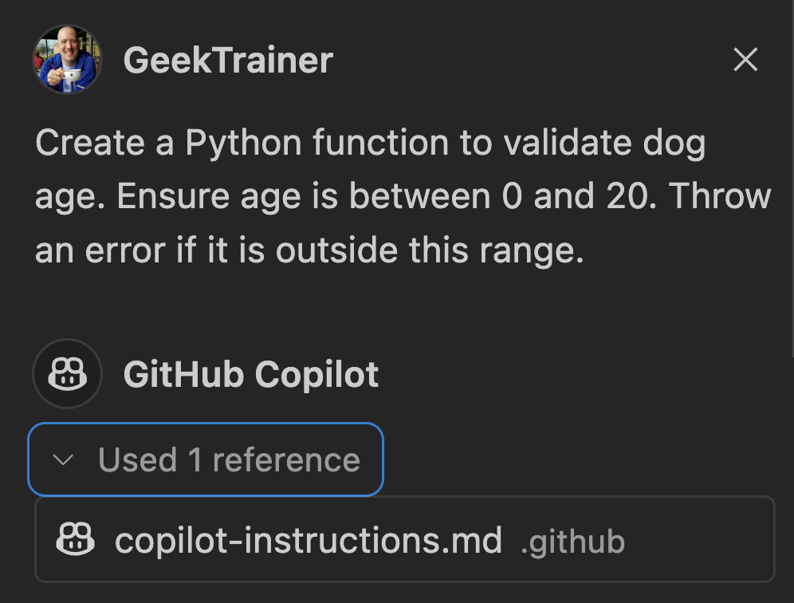

原文: https://github.com/github-samples/pets-workshop/blob/6eaf29e155d12b62700aa06a97b803ac1aa1130a/content/1-hour/3-copilot-instructions.md

# カスタム指示の提供

| [← GitHub Copilotがコンテキストを理解するために][walkthrough-previous] | [次へ: フィルター機能の追加 →][walkthrough-next] |
|:-----------------------------------|------------------------------------------:|

コードベースのためのコードを生成する際に誰もが知っておく必要がある重要な情報が常にあります - 使用されている技術、従うべきコーディング標準、プロジェクト構造などです。議論してきたように、コンテキストは非常に重要なので、Copilotも常にこの情報を持っているようにしたいと思うでしょう。幸い、Copilot指示の使用を通じてこの概要を提供できます。

## シナリオ

Copilotの助けを借りてサイトのより大きな更新を開始する前に、Copilotがアプリケーションの構築方法についてよく理解していることを確認したいと思います。そのため、リポジトリにCopilot指示ファイルを追加します。

## Copilot指示の概要

Copilot指示は、**.github**フォルダに配置されるマークダウンファイルです。プロジェクトの一部となり、コードベースのすべての貢献者にとってもそうなります。このファイルを使用して、従いたい様々なコーディング標準、プロジェクトが使用する技術、またはCopilot Chatが提案を生成する際に理解することが重要なその他の事項を示すことができます。

> [!IMPORTANT]
> *copilot-instructions.md*ファイルは、GitHub Copilot Chatへの**すべて**の呼び出しに含まれ、Copilotに送信されるコンテキストの一部になります。LLMが操作できるトークンセットは常に限られているため、大きなCopilot指示ファイルは関連情報を曖昧にする可能性があります。そのため、Copilot指示ファイルはプロジェクト全体の情報に限定し、構築している内容と構築方法の概要を提供すべきです。特定のタスクについてより具体的な情報を提供する必要がある場合は、[プロンプトファイル](https://docs.github.com/en/copilot/customizing-copilot/adding-repository-custom-instructions-for-github-copilot?tool=vscode#about-prompt-files)を作成できます。

Copilot指示ファイルを作成する際に考慮すべきガイドラインは次のとおりです：

- Copilot指示ファイルはプロジェクトの一部となるため、すべての開発者に適用されます。ファイルに示されている内容は、グローバルに適用可能であるべきです。
- ファイルはマークダウンなので、コンテンツをグループ化して読みやすさを向上させることができます。
- **何を**構築しているか、**どのように**構築しているかの概要を提供します。これには以下が含まれます：
    - 使用している言語、フレームワーク、ライブラリ。
    - 生成すべき必要なアセット（単体テストなど）とそれらを配置すべき場所。
    - 次のような言語固有のルール：
        - Pythonで[型ヒント][type-hints]を使用する。
        - TypeScriptで`function`キーワードではなく[アロー関数][arrow-functions]を使用する。
- GitHub Copilotが一貫して予期しない提案を提供する場合（例：Reactでクラスコンポーネントを使用）、それらのメモを指示ファイルに追加します。

## Copilot指示ファイルの作成

Copilot指示ファイルを作成しましょう。まずCopilotにコードブロックの生成を依頼し、次に指示ファイルを追加し、次に同じ質問を再度尋ねて変更を確認します。

1. プロジェクトが開いているIDEに戻ります。
2. IDEで開いている可能性のあるタブをすべて閉じて、Copilotチャットが空のコンテキストを持つことを確認します。
3. Copilotチャットの上部にある`+`アイコンを選択して新しいチャットを開始します。
4. Copilot Chatを開いて次のプロンプトを送信します：

    ```
    犬の年齢を検証するPython関数を作成してください。年齢が0から20の間であることを確認してください。この範囲外の場合はエラーをスローしてください。
    ```

5. 関数シグネチャが型ヒントなしで`def validate_dog_age(age)`のようになっていることに注意してください。

> [!NOTE]
> LLMは決定論的ではなく確率的であるため、正確なコードは異なります。

6. **.github**フォルダに**copilot-instructions.md**という新しいファイルを作成します。
7. プロジェクト構造と要件に関する情報を提供するマークダウンをファイルに追加します：

    ```markdown
    # 犬の保護施設

    これは、人々が養子にする犬を探すためのアプリケーションです。モノレポで構築されており、Flaskベースのバックエンドと、Astroベースのフロントエンドがあります。

    ## バックエンド

    - FlaskとSQLAlchemyを使用して構築
    - 型ヒントを使用

    ## フロントエンド

    - AstroとSvelteを使用して構築
    - TypeScriptはfunctionキーワードではなくアロー関数を使用すべき
    - ページはモダンな外観と感触のダークモードであるべき
    ```

8. ファイルを**保存**します。

## 指示ファイルの動作を確認

Copilotチャットへの呼び出しを行うたびに、参照ダイアログは応答を生成するために使用されたすべてのファイルを示します。Copilot指示ファイルを作成すると、参照セクションに常に含まれていることがわかります。型ヒントを使用するよう指示を含めたので、コード提案がこのガイダンスに従うことがわかります。

1. VS CodeまたはCodespaceで現在開いているすべてのファイルを閉じます。（これにより、空のコンテキストで作業していることを確認できます。）
2. GitHub Copilotチャットの`+`アイコンを選択して新しいチャットを開始します。
3. 以前に使用したのと同じプロンプトをCopilotチャットに送信します：

    ```
    犬の年齢を検証するPython関数を作成してください。年齢が0から20の間であることを確認してください。この範囲外の場合はエラーをスローしてください。
    ```

> [!TIP]
> 上矢印を使用してCopilotチャットに以前のプロンプトを再送信できます。

4. 参照に指示ファイルが含まれ、そこから収集された情報を提供していることに注意してください。

    

5. 結果のPythonが型ヒントを使用し、関数シグネチャが次のようになることに注意してください：

    ```python
    def validate_dog_age(age: int):
    ```

> [!NOTE]
> 生成される正確なコードは異なりますが、新しいPython提案は型ヒントを使用するはずです。

## 日本コミュニティ補足

このカスタム指示ファイルを自動生成するコマンドが組みこまれています。F1からコマンド「チャット: ワークスペース指示ファイルを生成する(Chat: Generate Workspace Instructions File)」を実行してください。

## 概要と次のステップ

Copilot指示は提案の品質を向上させ、設置している望ましい実践との整合性をより良く確保します。基盤が整ったので、[ウェブサイトに新しい機能を追加][walkthrough-next]しましょう！

## リソース

- [GitHub Copilotのリポジトリカスタム指示の追加][custom-instructions]


| [← GitHub Copilotがコンテキストを理解するために][walkthrough-previous] | [次へ: フィルター機能の追加 →][walkthrough-next] |
|:-----------------------------------|------------------------------------------:|

[arrow-functions]: https://developer.mozilla.org/en-US/docs/Web/JavaScript/Reference/Functions/Arrow_functions
[custom-instructions]: https://docs.github.com/en/copilot/customizing-copilot/adding-repository-custom-instructions-for-github-copilot
[type-hints]: https://mypy.readthedocs.io/en/stable/cheat_sheet_py3.html
[walkthrough-previous]: ./2-explore-project.md
[walkthrough-next]: ./4-add-feature.md