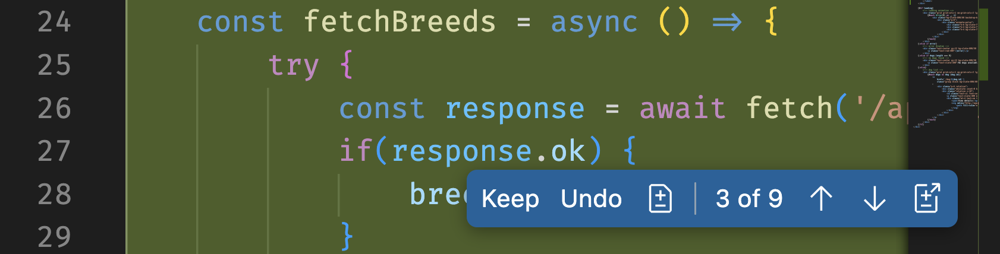
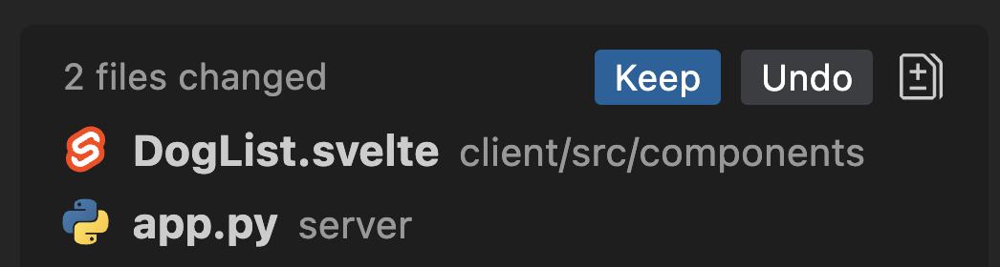

# フィルター機能の追加

| [← カスタム指示の提供][walkthrough-previous] | [次へ: ボーナスコンテンツ →][walkthrough-next] |
|:-----------------------------------|------------------------------------------:|

プロジェクトを探索し、受け取る提案が期待する品質になるようにコンテキストを提供するGitHub Copilotの使用方法を探索しました。今度は、この準備作業を活用して新しいコードを生成することに注意を向けましょう！GitHub Copilotを使用してウェブサイトに機能を追加することを支援します。

## シナリオ

ウェブサイトは現在、データベース内のすべての犬をリストしています。保護施設が数匹の犬しかいなかった時はこれで適切でしたが、時間が経つにつれて数が増え、養子縁組可能な犬を人々が探すのが困難になっています。保護施設は、ユーザーが犬種を選択して、養子縁組可能な犬のみを表示できるフィルターをウェブサイトに追加するよう依頼しました。

## Copilot Edits

以前はCopilotチャットを使用しましたが、これは個別のファイルで作業したり、コードについて質問したりするのに適しています。しかし、多くの更新はコードベース全体で複数のファイルへの変更を必要とします。ウェブページの一見基本的な変更でも、HTML、CSS、JavaScriptファイルの更新が必要になることがあります。Copilot Editsを使用すると、複数のファイルを一度に変更できます。

Copilot Editsでは、更新が必要なファイルをコンテキストに追加します。プロンプトを提供すると、Copilot Editsはコンテキスト内のすべてのファイルで更新を開始します。また、適切と判断した場合に新しいファイルを作成したり、コンテキストにファイルを追加したりする機能もあります。

## 犬リストページにフィルターを追加

ページにフィルターを追加するには、最低でも2つのファイル（FlaskバックエンドとSvelteフロントエンド）を更新する必要があります。幸い、Copilot Editsは複数のファイルを更新できます！Copilot Editsの助けを借りてページを更新しましょう。

> [!NOTE]
> Copilot Editsは自動保存が有効になっているときに最適に動作するため、それをアクティブ化します。この演習で後に探索するように、Copilot Editsは保持したくない変更を元に戻すための強力なツールを提供します。

1. プロジェクトが開いているIDEに戻ります。
2. IDE内で開いているタブをすべて閉じます。
3. **File** > **Auto Save**を選択して自動保存を有効にします。
4. GitHub Copilot Chatを開きます。
5. チャットビューの下部にあるチャットモードドロップダウンで**Edit**を選択してエディットモードに切り替えます（現在は**Ask**になっているはずです）
6. 利用可能な場合は、利用可能なモデルのリストから**Claude 3.5 Sonnet**を選択します
7. チャットウィンドウで**Add Context...**を選択します。
8. **server/app.py**と**client/src/components/DogList.svelte**ファイルを選択します（各ファイルに対して**Add context**を選択する必要があります）
> [!TIP]
> **Add context**をクリックした後にファイル名を入力すると、フィルターに表示されます。ファイルをドラッグしたり、エクスプローラーでファイルを右クリックして`Copilot -> Add File to Chat`を選択したりすることもできます）
9. ページに必要な更新を生成するようCopilotに依頼します。これは、犬種と犬が養子縁組可能かどうかの両方のフィルターを追加することです。独自の表現を使用し、次の要件が満たされていることを確認してください：
    - すべての犬種を含むドロップダウンリストを提供すべき
    - 利用可能な犬のみを表示するチェックボックスを利用可能にすべき
    - 変更が行われるたびにページが自動的に更新されるべき

> [!NOTE]
> プロンプトを生成する際は独自の表現を使用すべきです。前にハイライトしたように、演習の一部はGitHub Copilotのプロンプトを作成することに慣れることです。1つの重要なヒントは、探しているコードを確実に取得するために、より多くのガイダンスを提供することは常に良いことです。

Copilotが提案の生成を開始します！

## 提案の確認

個別のファイルで作業した前の例とは異なり、現在は複数のファイル間での変更、そしておそらく複数のファイルの複数のセクションで作業しています。幸い、Copilot Editsにはこのプロセスを合理化する機能があります。

GitHub Copilotは次の変更を提案します：

- すべての犬をリストするエンドポイントを更新して、犬種と利用可能性のパラメータを受け入れます。
- ウェブページを更新してドロップダウンリストとチェックボックスを含めます。

コードが生成されると、ファイルがdiffファイルと同様の体験を使用して表示され、新しいコードが緑色でハイライトされ、古いコードが赤色でハイライトされます（デフォルト）。

個別のファイルを開くと、提供されたボタンを使用して変更を保持または元に戻すことができます。

すべての変更を保持または元に戻すこともできます。

そして

1. コード提案を確認して、期待どおりに動作することを確認し、必要な変更を行います。満足したら、ファイルごとに個別に**Keep**を選択するか、Copilot Chatで**Keep**を選択してすべての変更を受け入れることができます。
2. [http://localhost:4321][tailspin-shelter-website]でページを開いて更新を確認します！
3. 以前と同様にターミナルで`python -m unittest`を使用してPythonテストを実行します。
4. 変更が必要な場合は、GitHub Copilotに必要な更新を説明し、新しいコードを生成させます。

> [!IMPORTANT]
> 反復的に作業することは、AIペアプログラマーとのコーディングの通常の側面です。Copilotが理解するためにより多くのコンテキストを提供したり、追加のリクエストを行ったり、元のプロンプトを言い換えたりすることは常にできます。反復的に作業することを支援するために、Copilot Editsインターフェースの上部に元に戻すボタンと再実行ボタンがあることがわかります。これにより、プロンプト間を前後に移動できます。
>
> 

5. 機能が期待どおりに動作することを確認し、**Keep**を選択してすべての変更を受け入れます。
6. オプション：**File** > **Auto Save**の選択を解除して自動保存を無効にします。

## 概要

GitHub Copilotと協力してウェブサイトに新しい機能を追加しました - 犬のリストをフィルタリングする機能です。Copilot Editsの助けを借りて、プロジェクト全体で複数のファイルを更新し、反復的に望ましい機能を構築しました。

## ワークショップレビュー

ワークショップの過程で、GitHub Copilotのコア機能を探索しました。インライン提案を取得するためのコード補完、プロジェクトを探索するためのチャット参加者、コンテキストを追加するためのCopilot指示、複数のファイルを更新するためのCopilot Editsの使用方法を見ました。

GitHub Copilotを使用する正しい方法は1つではありません。さまざまなプロンプトを探索し続けて、ワークフローに最適な方法とGitHub Copilotが生産性を支援する方法を発見してください。

## リソース

- [IDEでGitHub Copilotに質問する][copilot-ask]
- [Copilot Chatクックブック][copilot-cookbook]
- [Copilot Edits][copilot-edits]

| [← カスタム指示の提供][walkthrough-previous] | [次へ: ボーナスコンテンツ →][walkthrough-next] |
|:-----------------------------------|------------------------------------------:|

[copilot-ask]: https://docs.github.com/en/copilot/using-github-copilot/copilot-chat/asking-github-copilot-questions-in-your-ide
[copilot-cookbook]: https://docs.github.com/en/copilot/copilot-chat-cookbook
[copilot-edits]: https://code.visualstudio.com/docs/copilot/copilot-edits
[tailspin-shelter-website]: http://localhost:4321
[walkthrough-previous]: ./3-copilot-instructions.md
[walkthrough-next]: ./5-bonus.md
