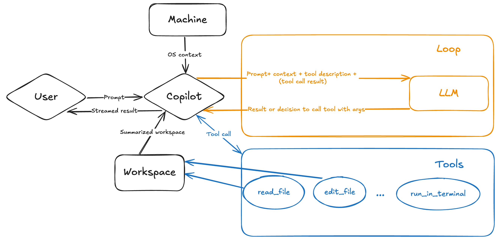
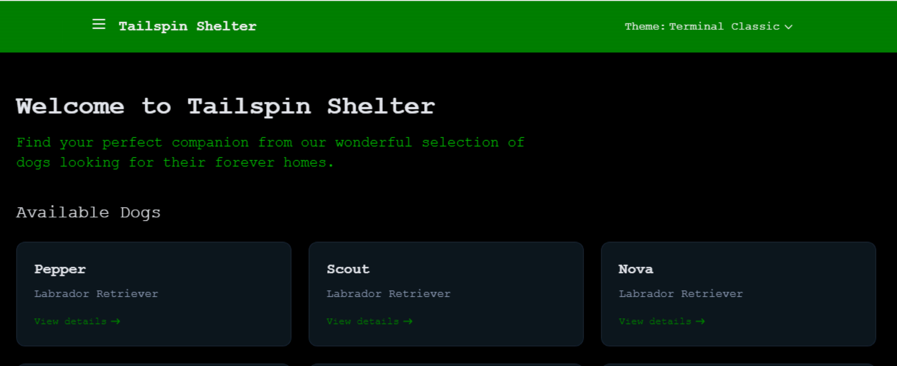

原文: https://github.com/github-samples/pets-workshop/blob/6eaf29e155d12b62700aa06a97b803ac1aa1130a/content/1-hour/5-bonus.md

# ボーナスコンテンツ

| [← フィルター機能の追加][walkthrough-previous] | [次へ: ペットワークショップの選択 →][walkthrough-next] |
|:-----------------------------------|------------------------------------------:|

## Copilotエージェントモードの概要

Visual Studio Codeのチャットエージェントモードでは、自然言語を使用して高レベルなタスクを定義し、そのタスクを達成するためのエージェンティックコード編集セッションを開始できます。エージェントモードでは、Copilotが**自律的に**必要な作業を計画し、関連するファイルとコンテキストを決定します。その後、コードベースに編集を行い、要求されたタスクを達成するためにツールを呼び出します。エージェントモードは編集とツールの結果を監視し、発生する問題を解決するために反復します。

> [!IMPORTANT]
> Copilotは要求されたタスクを完了するために必要な操作を自律的に決定しますが、開発者として常にあなたが責任者です。すべてが正しく完了していることを確認するためにCopilotと協力し、コードを読み、レビューします。また、コードレビュー、テスト、セキュリティスキャンなどの適切なDevOps慣行に従い続けることも重要です。

なぜエディットモードではなくエージェントモードを使用するのでしょうか？

- **編集範囲**：エージェントモードは、関連するコンテキストと編集するファイルを自律的に決定します。エディットモードでは、コンテキストを自分で指定する必要があります。
- **タスクの複雑さ**：エージェントモードは、コード編集だけでなく、ツールとターミナルコマンドの呼び出しも必要とする複雑なタスクにより適しています。
- **持続時間**：エージェントモードは、要求を処理するために複数のステップを含むため、応答を得るのに時間がかかる場合があります。たとえば、関連するコンテキストと編集するファイルを決定し、行動計画を決定するなどです。
- **自己修復**：エージェントモードは、生成された編集の結果を評価し、中間的な問題を解決するために複数回反復する場合があります。
- **リクエスト割り当て**：エージェントモードでは、タスクの複雑さによっては、1つのプロンプトがバックエンドへの多くのリクエストになる場合があります。

### 動作方法

## Tailspin Shelterウェブサイトにテーマを追加

このセクションでは、CopilotのエージェントモードでTailspin Shelterウェブサイトにテーマを追加します。テーマを選択してウェブサイトに適用できるようになります。

1. プロジェクトが開いているIDEに戻ります。
2. IDEで開いている可能性のあるタブをすべて閉じて、Copilotチャットのコンテキストが空であることを確認します。
3. Copilotチャットの上部にある`+`アイコンを選択して新しいチャットを開始します。
4. チャットウィンドウの下部にあるモデル選択ドロップダウンで（以前に`Edit`を選択したように）`Agent`を選択してエージェントモードを選択します。
5. 利用可能なモデルの1つ（一部利用できない場合があります）`Claude 3.7 Sonnet`、`Claude 3.5 Sonnet`、または`GPT-4.1 (Preview)`を選択します
6. に移動します
7. プロンプトの内容をコピーします
8. copilotプロンプト入力に内容を貼り付けます
9. エージェントモードは時間がかかります。関連するファイルを自分で検索し、複数のパスを実行し、自分自身と話してタスクを洗練します
10. エージェントが作業している間、使用されたプロンプトの内容を確認する機会を取ってください。
11. エージェントが完了したら（スピナーが表示されなくなり、サムズアップ/ダウンアイコンが表示されます）、ブラウザを開いて結果を確認します
    - [http://localhost:4321][tailspin-shelter-website]でページを開いて更新を確認します！
    - お好みでファイルに加えられた変更を確認します
    - 良かったですか？結果に満足していない場合は、エンドユーザーの結果を改善するためにチャットで追加のプロンプトを作成することで、プロンプトを洗練できます。新しいセッションを開始しないでください。それは対話的なプロセスです。
12. 結果に満足したら、`Done`を押します

Terminalテーマ（claude 3.7で生成）のようなものが得られる_可能性があります_

> [!IMPORTANT]
> LLMは決定論的ではなく確率的であるため、生成される正確なコードは異なる場合があります。上記は代表的な例です。あなたのコードが異なっていても、動作する限り問題ありません！

## Copilotで少し遊んでみる

1時間のワークショップの終わりまで来ました。おめでとうございます！GitHub Copilotを最大限に活用するためのコアスキルを探索しました。ここから、独自にさまざまなチャレンジを探索し、開発を続ける際にGitHub Copilotがどのようにサポートできるかを確認できます。

ここにリストされている提案は、まさにそれ - 提案です。独自のシナリオや、アプリケーションに必要だと思う機能を考案することは自由です。

ここにはステップバイステップの指示もありません。すでにCopilotが開発を支援する方法を見てきました。これらの追加提案で提示されたチャレンジの一部は、学んだことを適用してコードを作成することです！

### 試してみるプロンプト

[prompts][github-prompts-path]フォルダにプロンプトを提供しており、探索のインスピレーションとして直接使用できます。

> [!TIP]
> これらのプロンプトはワンショットとして使用されることを意図していますが、汎用的で再利用可能なプロンプトがある場合、プロンプトはチームメンバーとプロンプトを共有する優れた方法です。よく知られたフォルダに配置し、Copilot Chatで直接参照することで呼び出すことができます。
> [Visual Studio Codeでの再利用可能なプロンプト][vscode-prompts]について詳しく学ぶ

### 可能性のある次のステップ

これまでに行ったことに基づいて、継続的に成長し、構築する方法のアイデアをいくつか示します：

- 以前にFlaskで更新したAPIエンドポイントに戻り、単体テストを追加します。
- 犬の完全なリストまたは5つ以上の結果を持つ結果ページにページングサポートを追加します。
- 犬が利用可能な場合に、ユーザーが犬の養子縁組を申請できるフォームを追加します。
- ユーザーが見つけた犬を登録できるフォームを追加します。

| [← フィルター機能の追加][walkthrough-previous] | [次へ: ペットワークショップの選択 →][walkthrough-next] |
|:-----------------------------------|------------------------------------------:|

[walkthrough-previous]: ./4-add-feature.md
[walkthrough-next]: ../README.md
[tailspin-shelter-website]: http://localhost:4321
[github-prompts-path]: ../prompts/
[vscode-prompts]: https://aka.ms/vscode-ghcp-prompt-snippets