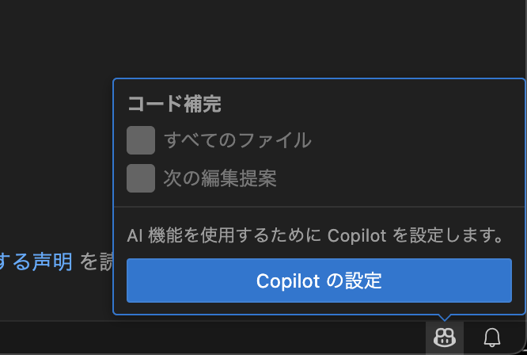
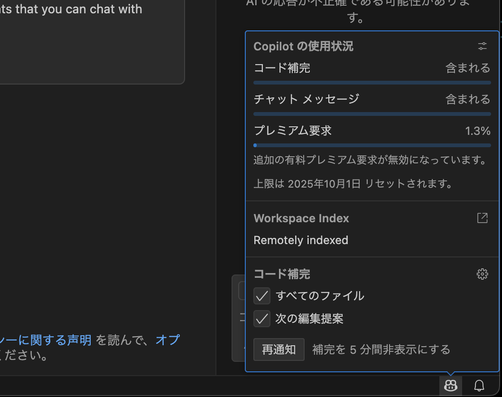

原文: https://github.com/github-samples/pets-workshop/blob/6eaf29e155d12b62700aa06a97b803ac1aa1130a/content/1-hour/README.md

# GitHub Copilotの開始

| [← ペットワークショップの選択][walkthrough-previous] | [次へ: ワークショップのセットアップ →][walkthrough-next] |
|:-----------------------------------|------------------------------------------:|

AIペアプログラマーとして構築された[GitHub Copilot][copilot]は、コードの生成を支援し、重要なことに集中できるようにします。コード補完を通じて、コメントからコードを作成し、シグネチャだけから関数を作成できます。Copilotチャットでは、コードベースについて質問したり、新しいファイルを作成したり、既存のファイルを更新したり、コードベース全体でファイルを更新する操作を実行したりできます。

他のツールと同様に、習得する必要があるスキルセットがあり、それがこの（約）1時間のワークショップの目的です。既存のアプリケーションを探索し、機能を追加するために更新することで、利用可能な最も一般的なワークロードを探索します。

## 前提条件

ワークショップで使用するアプリケーションは、主にPython（FlaskとSQLAlchemy）とAstro（TailwindとSvelteを使用）で構築されています。これらのフレームワークと言語の経験は役立ちますが、Copilotを使用してプロジェクトを理解し、コードを生成します。そのため、プログラミングに精通している限り、演習を完了できます！

> [!NOTE]
> わからないコードブロックがある場合は、いつでもハイライトしてGitHub Copilotチャットに説明を求めることができます！

## 必要なリソース

このワークショップを完了するには、以下が必要です：

- [GitHubアカウント][github-account]。
- [GitHub Copilot][copilot]へのアクセス（個人向けに無料で利用可能です！）

## 必要なローカルインストール

また、以下もローカルで利用可能でインストールされている必要があります：

### コードエディター

- [Visual Studio Code][vscode-link]。
- [IDEにインストールされたCopilot拡張][copilot-extension]。

#### 日本コミュニティ補足

Copilotを利用できるようにする必要があります。

VS Codeを開き、右下のステータスバーのCopilotのアイコンをクリックして、以下の画像のように「Copilotの設定」が出ている状態であれば、セットアップが必要な状態です。



「Copilotの設定」をクリックして、GitHub認証を進めてください。
再度、Copilotのアイコンをクリックしたときに、以下の画像のように使用状況が表示されていればセットアップ完了です。



もし、うまくいかない場合にはリポジトリのDiscussionにて、状況をお知らせください。

https://github.com/vscodejp/github-samples-pets-workshop-japanese-content/discussions/categories/vs-code-dev-day-tokyo-2025-09-q-a

### ローカルサービス

- 最新の[Node.jsランタイム][nodejs-link]。
- 最新バージョンの[Python][python-link]。
  - Windowsの場合、[Windows store経由でPython](https://apps.microsoft.com/detail/9pjpw5ldxlz5?hl=en-US&gl=US)をインストールできます。
- [git CLI][git-link]。
- BASHコマンドを実行できるシェル。

> [!NOTE]
> LinuxとmacOSは、追加の設定なしでBASHコマンドを実行できます。Windowsの場合、[Windows Subsystem for Linux (WSL)][windows-subsystem-linux]または[git][git-link]経由で利用可能なBASHシェルが必要です。

### 日本コミュニティ補足

元リポジトリではローカルにPython、Node.jsのランタイムをインストールすることを前提としていますが、コンテナ内に必要なランタイムをインストールしてローカル環境を変更せずに利用できるDev Container機能やGitHub Codespacesの利用も可能です。
ローカルでのインストールを避けたい場合や、うまくいかない場合に利用ください。
方法については、["DevContainerの利用"](#devcontainerの利用)と["GitHub CodeSpacesの利用"](#github-codespacesの利用)を確認ください。

もし、うまくいかない場合にはリポジトリのDiscussionにて、状況をお知らせください。

https://github.com/vscodejp/github-samples-pets-workshop-japanese-content/discussions/categories/vs-code-dev-day-tokyo-2025-09-q-a

#### Windowsでのgit及びbashのインストール

上記のgitをインストールした場合、Git Bashとして、bashも含まれていています。
同様のインストールはwingetでもできます。

```
winget install --id Git.Git -e
```

#### WindowsでのNodeJSのインストール

LTS版を使うにはwingetでインストールできます。

```
 winget install -e --id OpenJS.NodeJS.LTS
```

#### WindowsでのPythonのインストール

最新を使う場合にはwingetでインストールできます。

```
winget install -e --id Python.Python.3.13
```

#### macOSでのPythonのインストール

macOSの場合、デフォルトでインストールされているPythonはバージョン 3.9.6 と古いものです。

homebrewなどで最新のPythonをインストールするか、pyenv、uvなどを利用して、最新バージョンをインストールしてください

- homebrewで最新のPythonをインストールする: `brew install python`
- pyenv: https://github.com/pyenv/pyenv?tab=readme-ov-file#installation
- uv: https://docs.astral.sh/uv/#installation

#### macOSでのNode.jsのインストール

homebrewなどで最新のNode.jsをインストールするか、nodenvなどを利用して、最新バージョンをインストールしてください

- homebrewで最新のNode.jsをインストールする: `brew install node`
- nodenv: https://github.com/nodenv/nodenv?tab=readme-ov-file#installation

#### DevContainerの利用

DevContainerは、Dockerコンテナとして開発環境を構築する機能です。
既に環境構築するためのコンテナの定義ができているため、手順通りに立ち上げるだけで、環境構築が完了します。

こちらを利用する場合、以下の3つのインストールが必要です。

- [Visual Studio Code][vscode-link]。
- [Docker Desktop](https://www.docker.com/ja-jp/products/docker-desktop/)
- [拡張機能 Remote - Containers](https://marketplace.visualstudio.com/items?itemName=ms-vscode-remote.remote-containers) ([VS Codeで開く](vscode:extension/ms-vscode-remote.remote-containers))

> [!NOTE]
> ["必要なローカルインストール"](#必要なローカルインストール)の実施は不要ですが、["必要なリソース"](#必要なリソース)の準備は必要です。

Windowsを利用する場合、WSL2での利用が推奨されています。以下のドキュメントを確認し、「Docker Desktop をインストールする」まで実施してください。

> https://learn.microsoft.com/ja-jp/windows/wsl/tutorials/wsl-containers?utm_source=chatgpt.com

こちらを利用する場合には、利用するテンプレートリポジトリを変更します。
詳しくは[次のページ 0-setup.md](./0-setup.md)に記載します。

#### GitHub Codespacesの利用

GitHub Codespacesは、リモートコンテナ機能を利用して、クラウド上に開発環境を構築する機能です。
クラウド上で動作するため、ローカルへの準備が不要です。
有償サービスですが、無料利用枠もあります。

こちらを利用する場合、以下の3つのインストールが必要です。

- [Visual Studio Code][vscode-link]。
- [拡張機能 GitHub Codespaces](https://marketplace.visualstudio.com/items?itemName=GitHub.codespaces) ([VS Codeで開く](vscode:extension/GitHub.codespaces))

> [!NOTE]
> ["必要なローカルインストール"](#必要なローカルインストール)の実施は不要ですが、["必要なリソース"](#必要なリソース)の準備は必要です。

こちらを利用する場合には、利用するテンプレートリポジトリを変更します。
詳しくは[次のページ 0-setup.md](./0-setup.md)に記載します。

## 開始

開始準備はできましたか？行きましょう！ワークショップシナリオでは、あなたをペット養子縁組センターでボランティアをしている開発者として想像します。人々が犬種と譲渡状況で検索結果を制限できるフィルターをウェブサイトに追加するよう依頼されました。次の5つの演習でタスクを実行するために作業します！

0. [ワークショップのリポジトリをクローンしてアプリを開始][walkthrough-next]する。
1. [サーバーにエンドポイントを追加][stage-1]してすべての犬種をリストする。
2. [プロジェクトを探索][stage-2]して何をする必要があるかをより良く理解する。
3. [カスタム指示を作成][stage-3]してCopilotチャットが追加のコンテキストを持つようにする。
4. [ウェブサイトに新しい機能を追加][stage-4]し、動作することを確認する！

## より深く学ぶためのリソースをチェック
[**GitHub-Copilot-Resources.md**][GitHub-Copilot-Resources]のリソースをチェックしてください。

このリソースリストは、GitHub Copilotについてより学び、効果的に使用する方法、将来の展望などを学ぶために慎重にキュレーションされています。GitHub Developer Relationsチームやその他のGitHubからの最新ビデオを含むYouTubeプレイリストもあります。

| [← ペットワークショップの選択][walkthrough-previous] | [次へ: ワークショップのセットアップ →][walkthrough-next] |
|:-----------------------------------|------------------------------------------:|

[copilot]: https://github.com/features/copilot
[copilot-extension]: https://docs.github.com/en/copilot/managing-copilot/configure-personal-settings/installing-the-github-copilot-extension-in-your-environment
[git-link]: https://git-scm.com/
[github-account]: https://github.com/join
[nodejs-link]: https://nodejs.org/en
[python-link]: https://www.python.org/
[stage-1]: ./1-add-endpoint.md
[stage-2]: ./2-explore-project.md
[stage-3]: ./3-copilot-instructions.md
[stage-4]: ./4-add-feature.md
[walkthrough-previous]: ../README.md
[walkthrough-next]: ./0-setup.md
[windows-python-link]: https://apps.microsoft.com/detail/9pjpw5ldxlz5
[windows-subsystem-linux]: https://learn.microsoft.com/en-us/windows/wsl/about
[vscode-link]: https://code.visualstudio.com/
[GitHub-Copilot-Resources]: ../GitHub-Copilot-Resources.md
