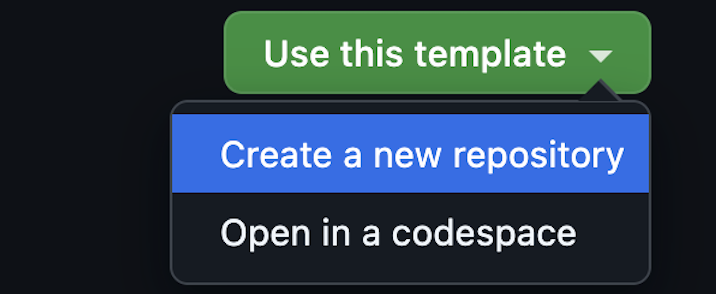

# ワークショップのセットアップ

| [← Modern DevOps with GitHub][walkthrough-previous] | [Next: Enable Code Scanning →][walkthrough-next] |
|:-----------------------------------|------------------------------------------:|

このワークショップを完了するには、このリポジトリの内容のコピーを含むリポジトリを作成する必要があります。これは[リポジトリをフォーク][fork-repo]することで実行できますが、フォークの目的は最終的にコードを元の（またはアップストリーム）ソースにマージすることです。今回の場合、変更をマージする予定がないため、別のコピーが必要です。これは[テンプレートリポジトリ][template-repo]の使用によって実現されます。テンプレートリポジトリは、プロジェクト間の一貫性を確保し、組織にスターターを提供する優れた方法です。

このワークショップのリポジトリはテンプレートとして構成されているため、これを使用してあなたのリポジトリを作成できます。

## リポジトリを作成する
ワークショップで使用するリポジトリを作成しましょう。

1. [リポジトリのルート][repo-root] に移動します
2. **Use this template** > **Create a new repository** を選択します
    
3. **Owner** の下で、あなたの GitHub ハンドルの名前、またはワークショップリーダーが指定した所有者を選択します。
4. **Repository** の下で、名前を **pets-workshop**、またはワークショップリーダーが指定した名前に設定します。
5. 可視性について **Public** が選択されていることを確認するか、ワークショップリーダーが指示した値を選択します。
6. **Create repository from template** を選択します。
    

数分でこのワークショップ用のテンプレートから新しいリポジトリが作成されます！

## まとめと次のステップ
これでワークショップで使用するリポジトリを作成しました！次に、書くコードをセキュアにするために[コードスキャンを有効化][walkthrough-next]しましょう。

| [← Modern DevOps with GitHub][walkthrough-previous] | [Next: Enable Code Scanning →][walkthrough-next] |
|:-----------------------------------|------------------------------------------:|

[fork-repo]: https://docs.github.com/en/get-started/quickstart/fork-a-repo
[template-repo]: https://docs.github.com/en/repositories/creating-and-managing-repositories/creating-a-template-repository
[repo-root]: /
[walkthrough-previous]: README.md
[walkthrough-next]: 1-code-scanning.md
