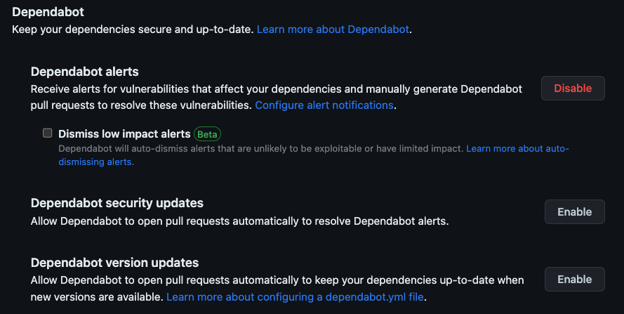
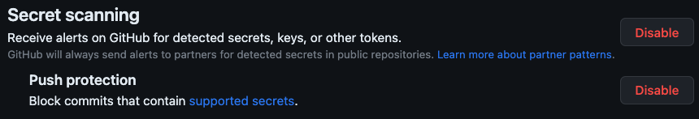
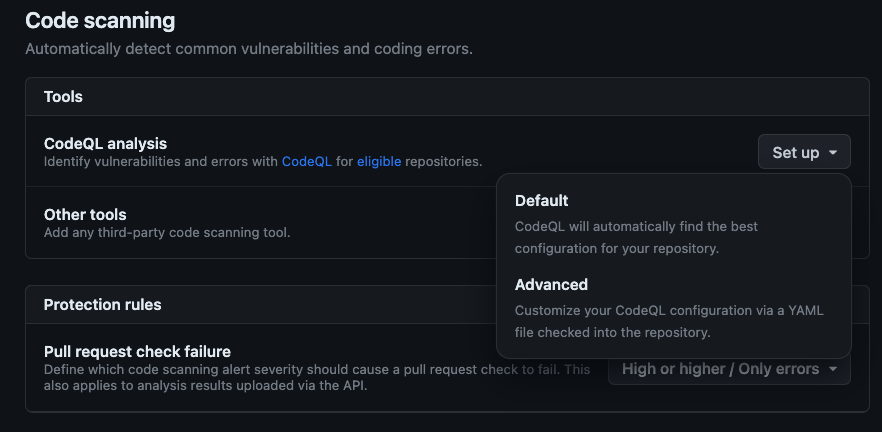
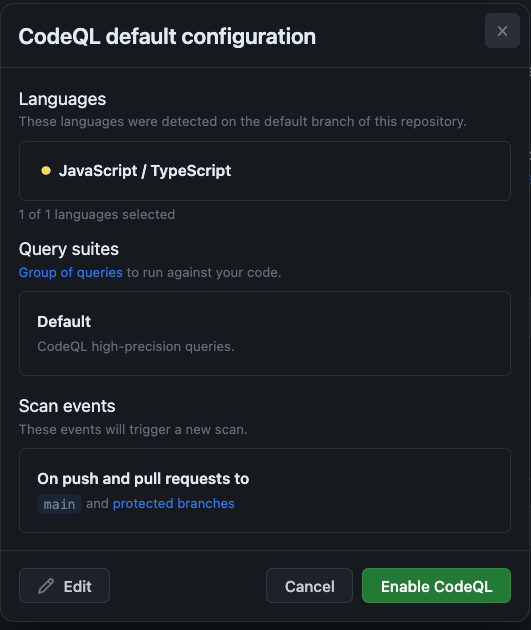

# パイプラインのセキュリティ保護

| [← Workshop setup][walkthrough-previous] | [Next: Project management with GitHub Issues →][walkthrough-next] |
|:-----------------------------------|------------------------------------------:|

Ensuring code security is imperative in today's environment. When we think about how we create code today, there's three main areas to focus on:

- The code we write
- The code we use through libraries and packages
- The credentials needed to access services

To help support developers and security teams, [GitHub Advanced Security][advanced-security] provides a suite of tools which cover these focus areas. Code Scanning will check the code you write, Dependabot ensures the libraries you use are secure, and Secret Scanning looks for any keys or tokens which are checked into code.

Let's explore each of these, and enable them on our repository. We'll see them in action when we create a pull request with new code later in the workshop.

## Scenario

セキュリティは DevOps プロセスの基本的な部分です。プロセスの早い段階でセキュリティを考慮することで、問題を安価に検出・解決できます。これは「[左にシフト][shift-left]」と呼ばれ、プロセスの早い段階（左側）でセキュリティについて考えることを意味します。

GitHub には、コードをセキュアにし、アプリケーションで使用されている依存関係を監視するためのツールが多数組み込まれています。これらのツールには以下が含まれます：

- **[Dependabot][dependabot]**: 依存関係の更新を自動化し、脆弱性アラートを提供します
- **[シークレットスキャン][secret-scanning]**: ソースコードとコミット履歴内のシークレットと認証情報をスキャンします
- **[コードスキャニング][code-scanning]**: 脆弱性とコーディングエラーを特定します

これらのツールを有効にして、コードベースが安全であることを確認しましょう。

## Dependabot

ほとんどのプロジェクトはオープンソースやその他の外部ライブラリに依存しています。これらのリソースなしには現代の開発は不可能に見えますが、依存している依存関係が安全であることを常に確認する必要があります。[Dependabot][dependabot-quickstart] はリポジトリが持つ依存関係を調べ、アラートを発生させたり、依存関係を安全なバージョンに更新するための[プルリクエスト][about-prs]（PR）を作成したりします。

### Dependabot の設定

GitHub のパブリックリポジトリには自動的に Dependabot アラートが設定されています。この機能は、不安全なパッケージが検出されるたびにアラートを生成します。不安全なライブラリが検出されたときにライブラリのバージョンを更新する PR を作成するように Dependabot を設定しましょう。

1. このワークショップ用に作成したリポジトリに移動します。
1. **Settings** タブを選択します。
2. 左側で **Code security** を選択します。
3. ページの中央付近にある **Dependabot** セクションを見つけます：

    

4. **Dependabot security updates** の隣にある **Enable** を選択して、アラートを解決するための PR を作成するように Dependabot を設定します。

これで Dependabot アラートとセキュリティ更新が有効になりました！不安全なライブラリが検出された場合、アラートを受信し、Dependabot がライブラリの安全なバージョンにバージョン番号を更新するための新しいプルリクエストを作成します。

> [!IMPORTANT]
> Dependabot セキュリティ更新を有効にした後、潜在的に古いパッケージに対して作成された新しい[プルリクエスト][about-prs]に気付く場合があります。このワークショップでは、これらのプルリクエストを無視してください。

## シークレットスキャン

多くの開発者が、トークンやユーザー名、パスワードを含むコードをチェックインしています。これは開発者がショートカットを取ろうとしたからか、キーを保護する適切なメカニズムを知らなかったからか、または後で片付けるつもりでそのままにしていたものの決して実行しなかったからかもしれません。

理由に関係なく、一見無害なトークンでもセキュリティ問題を引き起こす可能性があります。トークンとキーを公開しないよう常に注意し、問題をできるだけ迅速に検出したいと考えています。シークレットスキャンはまさにこれを行うために構築されています。ソースコードでトークンが検出されると、アラートが発生します。プッシュ保護を有効にして、[サポートされているシークレット][supported-secrets]を含むコードがリポジトリにプッシュされないようにすることもできます。

### シークレットスキャンの有効化

潜在的なキーを検出するためにシークレットスキャンを有効にしましょう。

1. 同じページ（**Settings** > **Code security and analysis**）で、一番下に向かって **Secret scanning** セクションを見つけます。
1. **Receive alerts on GitHub for detected secrets, keys or other tokens** の隣にある **Enable** を選択します。
1. **Push protection** の隣にある **Enable** を選択して、[サポートされているシークレット][supported-secrets]を含むリポジトリへのプッシュをブロックします。

    

これで、シークレットスキャンとプッシュ保護が有効になりました。これにより、キーがリポジトリにプッシュされることをブロックし、キーがソースコードに追加されたときに迅速に検出することができます。

## コードスキャニング

組織が作成するコードの量と潜在的な攻撃ベクターの間には直接的な関係があります。ソースコードを脆弱性について常にチェックしたいと考えています。[コードスキャニング][about-code-scanning]はソースコードの既知の脆弱性をチェックします。プルリクエストで問題が検出されると、開発者にコンテキスト情報を提供するソースコードの行をハイライトした新しいコメントが追加されます。これにより、問題を迅速に解決できます。

> [!NOTE]
> コードスキャニングは、GitHub の自動化プラットフォームである [GitHub Actions][github-actions] の上に構築されています。このワークショップの後半で GitHub Actions の詳細を探索し、独自のワークフローを作成します。

### コードスキャニングの有効化

ソースコードの脆弱性を検出するためにコードスキャニングを有効にしましょう。`main` にコードがプッシュされたとき、または `main` に対して[プルリクエスト][about-prs]が作成されたときに実行されるデフォルトの実装を使用します。また、新しく発見された潜在的な脆弱性が検出されるように、設定されたスケジュールで実行されます。

1. 同じページ（**Settings** > **Code security and analysis**）で、一番下に向かって **Code scanning** セクションを見つけます。
1. **CodeQL analysis** の隣にある **Set up** > **Default** を選択します。

    

1. **CodeQL default configuration** ダイアログで、**Enable CodeQL** を選択します。

    

> [!IMPORTANT]
> あなたの言語リストは異なる場合があります

バックグラウンドプロセスが開始され、[CodeQL とコードスキャニング][about-code-scanning]を使用してコードを分析するワークフローが設定されます。

## まとめと次のステップ

この演習では、GitHub Advanced Security を有効にしました。プロジェクトが依存するライブラリをチェックする Dependabot、キーとトークンを探すシークレットスキャン、ソースコードを検査するコードスキャニングを有効にしました。これらのツールは、アプリケーションが安全であることを確認するのに役立ちます。次は、機能リクエストを追加するために[Issue をファイル][walkthrough-next]する時です。

### 追加リソース

- [GitHub Advanced Security について][advanced-security-docs]
- [GitHub Skills: リポジトリのサプライチェーンを保護する][skills-supply-chain]
- [GitHub Skills: セキュアコードゲーム][skills-secure-code]

| [← Workshop setup][walkthrough-previous] | [Next: Project management with GitHub Issues →][walkthrough-next] |
|:-----------------------------------|------------------------------------------:|

[advanced-security]: https://github.com/features/security
[advanced-security-docs]: https://docs.github.com/en/get-started/learning-about-github/about-github-advanced-security
[about-code-scanning]: https://docs.github.com/en/code-security/code-scanning/automatically-scanning-your-code-for-vulnerabilities-and-errors/about-code-scanning
[about-prs]: https://docs.github.com/en/pull-requests/collaborating-with-pull-requests/proposing-changes-to-your-work-with-pull-requests/about-pull-requests
[dependabot-quickstart]: https://docs.github.com/en/code-security/getting-started/dependabot-quickstart-guide
[github-actions]: https://github.com/features/actions
[supported-secrets]: https://docs.github.com/en/code-security/secret-scanning/secret-scanning-patterns#supported-secrets
[skills-supply-chain]: https://github.com/skills/secure-repository-supply-chain
[skills-secure-code]: https://github.com/skills/secure-code-game
[walkthrough-previous]: 0-setup.md
[walkthrough-next]: 2-issues.md
