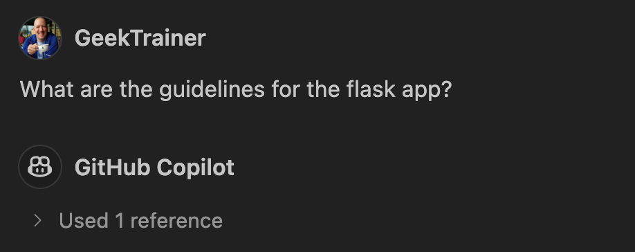

# GitHub Copilot のコンテキスト理解を支援する

| [← Implement testing][walkthrough-previous] | [Next: Coding with GitHub Copilot →][walkthrough-next] |
|:-----------------------------------|------------------------------------------:|

コーディング（そして人生の多くの部分）における成功の鍵はコンテキストです。コードベースにコードを追加する前に、既に設置されているルールと構造を理解したいと考えています。GitHub Copilot などの AI コーディングアシスタントと作業する場合も同じ概念が適用されます - 提案の品質は Copilot が持つコンテキストに直接比例します。この機会を使って、与えられたプロジェクトを探索し、Copilot が最高の作業を行うために必要なコンテキストを確実に持てるように Copilot と対話する方法の両方を学びましょう。

## シナリオ

ウェブサイトに新しい機能を追加する前に、既存の構造を探索して更新が必要な場所を決定したいと考えています。また、[カスタム指示][copilot-custom-instructions]の形で Copilot にいくつかのコンテキストを提供して、コードを生成する最善の方法についてより良いアイデアを持てるようにしたいと考えています。

## GitHub Copilot を始める

GitHub Copilot は個人と企業の両方に提供されるクラウドベースのサービスです。個人として、サービスの[無料アカウントにサインアップ][copilot-signup]できます。登録後、通常は IDE 用の拡張機能をインストールします。これは [Visual Studio][copilot-vs]、[Visual Studio Code][copilot-vscode]、[NeoVIM][copilot-vim]、[JetBrains IDEs][copilot-jetbrains]、[XCode](copilot-xcode)、[Eclipse][copilot-eclipse] で利用できます。前の演習で定義した [Codespace][walkthrough-codespaces] を使用するため、拡張機能を手動でインストールする必要はありません - dev container を設定したときに既に行いました！

1. GitHub Copilot へのアクセスがまだない場合は、[無料トライアルにサインアップ][copilot-signup]してください。
2. [前の演習][walkthrough-codespaces]で、GitHub Copilot の拡張機能を自動的にインストールするように [devcontainer][devcontainer-docs] を設定したので、すべて準備完了です！

## チャット参加者と拡張機能

GitHub Copilot Chat には、GitHub Copilot に指示を提供し、外部サービスにアクセスするために利用できるチャット参加者と拡張機能のセットがあります。チャット参加者は IDE 内で動作し、プロジェクトにアクセスできるヘルパーですが、拡張機能は外部サービスを呼び出し、別のツールを開かずに情報を提供できます。1つの主要なチャット参加者 - `@workspace` に焦点を当てます。

`@workspace` はプロジェクトのインデックスを作成し、現在作業している内容について質問したり、プロジェクト内のリソースを見つけたり、コンテキストに追加したりできます。プロジェクト全体を考慮すべき場合や、どこから探し始めるべきか完全に確信がない場合に使用するのが最適です。現在のシナリオでは、プロジェクトについて質問したいので、`@workspace` は仕事に最適なツールです。

> [!NOTE]
> この演習では、学習体験の一部として Copilot との対話方法を発見することを目的としているため、入力する具体的なプロンプトは提供されていません。探している内容や達成したい目標を自然言語で自由に記述してください。

1. Codespace に戻るか、リポジトリに移動し**Code** > **Codespaces**とCodespaceの名前を選択して再度開きます。
2. GitHub Copilot Chat を開きます。
3. 上部の`+`アイコンを選択して新しいチャットを開始します。
4. チャットプロンプトウィンドウに`@workspace`と入力し、<kbd>tab</kbd>を押して選択または有効化し、続けてプロジェクトについて Copilot に質問します。使用されている技術、プロジェクトの内容、機能がどこにあるかなどを質問できます。
5. 数分かけて次の質問の答えを見つけるために探索してください：
    - 現在使用されているフレームワークは何ですか？
    - プロジェクトが使用するデータベースはどこにありますか？
    - フロントエンドはどのように構築されていますか？
    - バックエンドはどのように構築されていますか？
    - 犬の一覧表示に関わるファイルは何ですか？

## カスタム指示を提供する

GitHub Copilot から受け取るコード提案が期待と一致することを確実にするために、コンテキストが鍵となります。限られた情報で動作する場合、Copilot は探しているものについて推測を行い、時々間違って推測することがあります。コンテキストを提供することで、Copilot があなたの目標により良く合わせることができます。これを行う素晴らしい方法の一つは、[copilot-instructions.md][copilot-custom-instructions]ファイルを作成することです。このマークダウンファイルは**.github**フォルダに配置され、プロジェクトの一部となります。このファイルを使用して、従いたい様々なコーディング標準、プロジェクトが使用する技術、または Copilot Chat が提案を生成する際に理解すべきその他の重要な情報を示すことができます。

> [!IMPORTANT]
> *copilot-instructions.md*ファイルは GitHub Copilot Chat への**すべて**の呼び出しに含まれ、Copilot に送信されるコンテキストの一部となります。LLM が動作できるトークンのセットは常に限られているため、大きなセットの Copilot 指示は関連情報を不明瞭にする可能性があります。そのため、Copilot 指示ファイルはプロジェクト全体の情報に限定し、何を構築しているかとどのように構築しているかの概要を提供すべきです。特定のタスクにより具体的な情報を提供する必要がある場合は、必要に応じて[プロンプトファイル][copilot-prompt-files]を作成できます。

Copilot 指示ファイルを作成する際に考慮すべきガイドラインをいくつか示します：

- Copilot 指示ファイルはプロジェクトの一部となり、すべての開発者に適用されることを意味します；ファイルに示される内容はグローバルに適用可能であるべきです。
- ファイルはマークダウンなので、コンテンツをグループ化して可読性を向上させることで、その事実を活用できます。
- **何を**構築しているかと**どのように**構築しているかの概要を提供します。以下を含みます：
    - 使用している言語、フレームワーク、ライブラリ。
    - 生成すべき必要なアセット（ユニットテストなど）とそれらを配置すべき場所。
    - 言語固有のルール：
        - Python コードは常に PEP8 ルールに従うべき。
        - `function`キーワードではなくアロー関数を使用する。
- GitHub Copilot が一貫して予期しない提案を提供することに気づいた場合（例：React にクラスコンポーネントを使用）、それらのノートを指示ファイルに追加します。

Copilot 指示ファイルを作成しましょう。以前と同様に、探索と実験をしてもらいたいので、入力する正確な指示は提供しませんが、自分で作成するのに十分なコンテキストを提供します。

1. **.github**フォルダに**copilot-instructions.md**という新しいファイルを作成します。
2. プロジェクト構造と要件についての情報を提供するために必要なマークダウンをファイルに追加します。以下を含みます：
    - プロジェクト自体の概要（この演習の前半で収集した情報に基づく）。
    - サーバーとクライアントの両方を作成するために使用する言語とフレームワーク。
    - Flask アプリのルートにはユニットテストが必要で、データベース呼び出しをモックする必要があります。
    - ウェブサイトはダークモードで、モダンなルックアンドフィールを持つべきです。
3. ファイルを保存してください！

あなたの Copilot 指示ファイルは以下のようなものになる可能性があります（ただし、繰り返しますが - 自分の言葉とスタイルを使用してください！）：

```markdown
# Dog shelter

This is an application to allow people to look for dogs to adopt. It is built in a monorepo, with a Flask-based backend and Astro-based frontend.

## Backend

- Built using Flask and SQLAlchemy
- All routes require unit tests, which are created in *test_file.py* in the same folder as the file
- When creating tests, always mock database calls

## Frontend

- Built using Astro and Svelte
- Pages should be in dark mode with a modern look and feel
```

## 指示ファイルの動作を確認する

Copilot チャットに呼び出しを行うたびに、レスポンスには常に使用されているコンテキストが含まれます。コンテキストには開いているファイル（ハイライトしたコードに焦点を当てた）、および`#file`や`#folder`を使用して追加した個々のファイルやフォルダが自動的に含まれます。前述のように、`@workspace`を使用してワークスペースのインデックスを含めることもできます。参照ダイアログは、Copilot が提案とレスポンスを生成する際に使用していた情報を確認する素晴らしい方法です。Copilot 指示ファイルを作成すると、それが常に参照セクションに含まれていることがわかります。

1. VS Code または Codespace で現在開いているすべてのファイルを閉じます。
2. GitHub Copilot チャットで`+`アイコンを選択して新しいチャットを開始します。
3. Copilot チャットに**Flask アプリのガイドラインは何ですか？**と質問します。
4. 参照に指示ファイルが含まれ、そこから収集された情報が提供されていることに注意してください。



## まとめと次のステップ

おめでとうございます！質の高い提案を生成するための鍵である GitHub Copilot のコンテキストを探索しました。チャット参加者を使用して GitHub Copilot をガイドする方法と、構築しているものとその構築方法の概要を提供する Copilot 指示ファイルを作成する方法を見ました。これが設置されたので、[ウェブサイトに新しい機能を追加する][walkthrough-next]ことに注意を向ける時です！

## リソース

- [GitHub Copilot を始める][copilot-getting-started]
- [GitHub Copilot のリポジトリカスタム指示を追加する][copilot-custom-instructions]
- [GitHub Copilot の個人カスタム指示を追加する][copilot-personal-instructions]
- [Copilot Chat クックブック][copilot-chat-cookbook]
- [VS Code で Copilot Chat を使用する][vscode-copilot-chat]

| [← Implement testing][walkthrough-previous] | [Next: Coding with GitHub Copilot →][walkthrough-next] |
|:-----------------------------------|------------------------------------------:|

[copilot-chat-cookbook]: https://docs.github.com/en/copilot/copilot-chat-cookbook
[copilot-custom-instructions]: https://docs.github.com/en/copilot/customizing-copilot/adding-repository-custom-instructions-for-github-copilot
[copilot-eclipse]: https://marketplace.eclipse.org/content/github-copilot
[copilot-getting-started]: https://docs.github.com/en/copilot/getting-started-with-github-copilot
[copilot-jetbrains]: https://plugins.jetbrains.com/plugin/17718-github-copilot
[copilot-prompt-files]: https://docs.github.com/en/copilot/customizing-copilot/adding-repository-custom-instructions-for-github-copilot?tool=vscode#about-prompt-files
[copilot-personal-instructions]: https://docs.github.com/en/copilot/customizing-copilot/adding-personal-custom-instructions-for-github-copilot
[copilot-signup]: https://github.com/github-copilot/signup
[copilot-vim]: https://github.com/github/copilot.vim#getting-startedins.com/plugin/17718-github-copilot
[copilot-vs]: https://marketplace.visualstudio.com/items?itemName=GitHub.copilotvs
[copilot-vscode]: https://marketplace.visualstudio.com/items?itemName=GitHub.copilot
[copilot-xcode]: https://github.com/github/CopilotForXcode
[devcontainer-docs]: https://docs.github.com/en/codespaces/setting-up-your-project-for-codespaces/adding-a-dev-container-configuration/introduction-to-dev-containersopilot/adding-personal-custom-instructions-for-github-copilot
[vscode-copilot-chat]: https://code.visualstudio.com/docs/copilot/copilot-chat
[walkthrough-codespaces]: ./3-codespaces.mdvisualstudio.com/docs/copilot/copilot-chat
[walkthrough-next]: 6-code.md
[walkthrough-previous]: 4-testing.md
