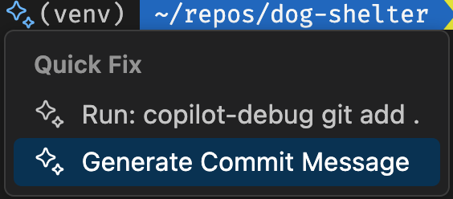

# GitHub flow

| [← Add new functionality][walkthrough-previous] | [Next: Deploy the application →][walkthrough-next] |
|:-----------------------------------|------------------------------------------:|

[GitHub flow][github-flow] は軽量で[ブランチベース][about-branches]のワークフローです。アイデアと新しいアプローチの自由なテストと探索を可能にし、それらがレビューされ、承認されればコードベースに取り込まれるように設計されています。高レベルでは、GitHub flow は次のパターンに従います：

1. ブランチを作成する
1. 望ましい変更を行う
1. [プルリクエスト][about-prs]を作成する
1. 変更をレビューし、フィードバックを収集して更新を行う
1. 継続的インテグレーションのテストなどの自動化された操作の結果をレビューする
1. 変更が承認された場合、コードベースにマージする

GitHub flow は、貢献者が継続的に探索、テスト、レビューを行い、自分の作業と他者の作業の上に構築するサイクルとして機能するように設計されています。

> [!NOTE]
> GitHub flow の重要な哲学の一つは、すべてのプルリクエストがマージされる必要がないということです。時には探索が目標であったり、機能がより大きなチームによって望まれていないものであったり、一から始め直す必要がある大幅な変更が必要であったりします。これはプロセスの一部であり、自由な実験を可能にします。

## シナリオ

[前の演習][code-exercise]で作成されたコード変更により、プルリクエストを作成し、更新をコードベースに組み込むために GitHub flow を実行する時が来ました。変更は既に行われているため（「従来の」フローから少し順序が外れていることを意味しますが）、ステップを実行して探索することができます。

## ブランチの作成

[ブランチ][about-branches]は同じリポジトリに保存されているコードのコピーです。ブランチを使用して更新をテストすることで、すべてのコードを同じリポジトリに保持しながら探索するための安全なスペースが得られます。

[GitHub Codespaces][github-codespaces]を使用する場合、ブランチを作成する方法はいくつかあります。コマンドラインを利用して[git](https://git-scm.com/docs/git-branch)コマンドを実行できます。Codespaceのソース管理ペインを使用してUIのサポートを受けてブランチを作成することもできます。この例では、コマンドラインを使用してブランチを作成します。

1. Codespace に戻るか、リポジトリに移動し**Code** > **Codespaces**とCodespaceの名前を選択して再度開きます。
2. <kbd>Ctl</kbd> + <kbd>`</kbd>を押して**ターミナルウィンドウ**を開きます。
3. ターミナルウィンドウで、以下のコマンドを入力して`add-filter`という名前の新しいブランチを作成し、そのブランチに切り替えます：

    ```bash
    git checkout -b add-filter
    ```

4. ターミナルウィンドウで以下のコマンドを入力して、新しいブランチにコミットするすべてのコードをステージします：

    ```bash
    git add .
    ```

5. **Quick fix**アイコン（スパークルで表現される）を選択し、**Generate Commit Message**を選択してCopilotにコミットメッセージを生成させます。

    。

6. <kbd>enter</kbd>を押してコマンドを実行します。
7. 最後に、ターミナルウィンドウで以下のコマンドを入力して新しいブランチをリポジトリにプッシュします：

    ```bash
    git push -u origin add-filter
    ```

## 更新を提案するプルリクエストを作成する

[プルリクエスト][about-prs]は、新しいコードを既存のコードベースにプルまたは組み込むリクエストです。プルリクエストが作成されると、他のチームメンバーがコードをレビューしてコメントを行い、[CI/CD][cicd-resources]プロセスが実行されるのが慣例です。すべてが完了し、コードがすべての人が承認する段階に達すると、コードベースにマージされます。

プルリクエストは、Codespaceのソース管理ペイン、リポジトリのウェブサイト、または[GitHub CLI][github-cli]を使用したコマンドラインを通じて作成できます。この例では、CLIでプルリクエストを作成し、ウェブサイトに移動してプルリクエストと実行中のアクションを確認し、コードをコードベースにマージします。

1. Codespace に戻ります。
1. ターミナルウィンドウで以下のコマンドを入力して、**Add component to display hours**というタイトルで[以前に作成したissue][issues-exercise]の番号を見つけます：

    ```bash
    gh issue list
    ```

1. ターミナルウィンドウで以下のコマンドを入力して、タイトル**Add hours component**、本文**Resolves #\<ISSUE_NUMBER\>**でプルリクエストを作成します。**\<ISSUE_NUMBER\>**を前のステップで取得したissue番号に置き換えてください：

    ```bash
    gh pr create -t "Add hours component" -b "Resolves #<ISSUE_NUMBER>"
    ```

## プルリクエストを探索してマージする

プルリクエストが作成されると、プルリクエストのページへのリンクが表示されます。そこからコメントを追加したり、実行中のワークフローを確認したり、プルリクエストを閉じるかマージするかを決定したりできます。プルリクエストに関連するワークフローの実行も確認できます。

このシナリオでは、アプリケーションのフロントエンドテスト用の自動化されたワークフローを作成しました。これは`main`へのプッシュまたはプルリクエストが行われるたびに実行されます。また、同じトリガーで実行されるように設定された[コードスキャニング][security-exercise]も有効にしました。プルリクエストを作成したばかりなので、これらの両方のワークフローが実行されます！

プルリクエストを探索し、ワークフローの実行を確認しましょう。テストが正常に実行されることを確認し、正常に実行されると仮定して、プルリクエストをマージします。

1. <kbd>Ctl</kbd> - **Click**（Macでは<kbd>Cmd</kbd> - **Click**）を使用してターミナルウィンドウに表示されたリンクをフォローします。
1. 表示されたページで、[以前に作成したエンドツーエンドテスト][testing-exercise]と[コードスキャニング][security-exercise]を実行しているワークフローに注意してください。
1. ワークフローが正常に完了したら、**Merge pull request**を選択して変更を**main**ブランチにマージします。

おめでとうございます！GitHub flow を使用して変更を提案し、レビューを実行し、それらをコードベースにマージしました。

## まとめと次のステップ

GitHub flow は変更を管理し、新機能をコードベースに組み込むためのワークフローです。GitHub flow は探索と実験の自由を与えると同時に、すべてのコードがマージされる前に検証プロセスに従うことを確保します。[アプリケーションをデプロイ][walkthrough-next]しましょう。

## リソース

- [GitHub flow][github-flow]
- [GitHub Skills: プルリクエストをレビューする][skills-review-prs]
- [GitHub Skills: Release based workflow][skills-release-workflow]

| [← Add new functionality][walkthrough-previous] | [Next: Deploy the application →][walkthrough-next] |
|:-----------------------------------|------------------------------------------:|

[about-branches]: https://docs.github.com/en/pull-requests/collaborating-with-pull-requests/proposing-changes-to-your-work-with-pull-requests/about-branches
[about-prs]: https://docs.github.com/en/pull-requests/collaborating-with-pull-requests/proposing-changes-to-your-work-with-pull-requests/about-pull-requests
[cicd-resources]: https://resources.github.com/ci-cd/
[code-exercise]: ./6-code.md
[github-codespaces]: https://github.com/features/codespaces
[github-cli]: https://cli.github.com/
[github-flow]: https://docs.github.com/en/get-started/quickstart/github-flow
[issues-exercise]: ./2-issues.md
[security-exercise]: ./1-code-scanning.md
[skills-review-prs]: https://github.com/skills/review-pull-requests
[skills-release-workflow]: https://github.com/skills/release-based-workflow
[testing-exercise]: ./4-testing.md
[walkthrough-previous]: 6-code.md
[walkthrough-next]: 8-deployment.md
